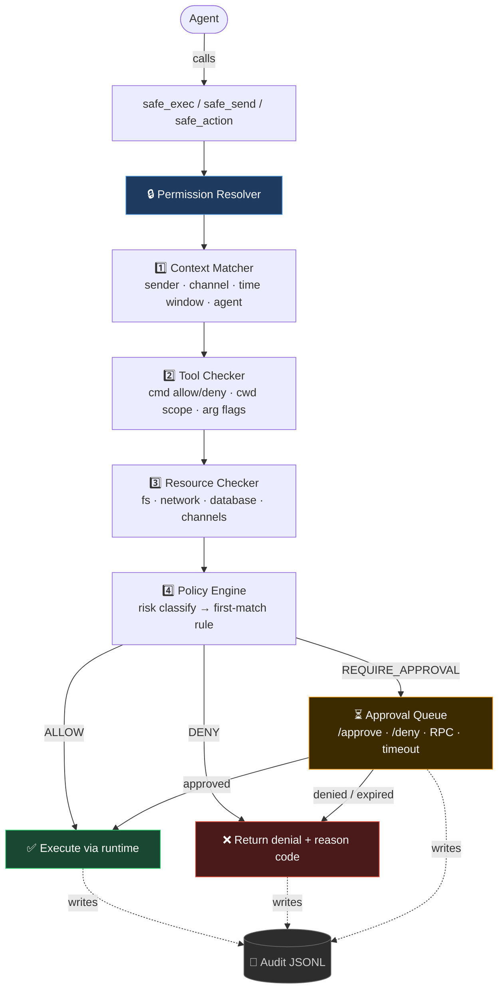

# ClawGuardrails 🦞

OpenClaw plugin that enforces a **4-stage permission pipeline** before any potentially destructive agent action. The agent can only execute shell commands, send channel messages, or trigger external APIs through controlled wrapper tools (`safe_exec`, `safe_send`, `safe_action`) — every call is risk-classified, policy-matched, and optionally routed through a human approval queue.

---

## Architecture



**Default behaviour (out of the box):**
- LOW risk → allowed
- MEDIUM / HIGH risk → requires human approval
- CRITICAL risk → denied immediately
- Channel writes → always require approval

---

## Installation on production OpenClaw

### Option 1 — install from npm registry (production)

```bash
openclaw plugins install @eveiljuice/claw-guardrails --pin
```

### Option 2 — `--link` (recommended for local path)

```bash
openclaw plugins install --link /path/to/claw-plugin
```

This registers the folder as a plugin without copying it. Restart the Gateway after.

### Option 3 — Copy to workspace extensions

```bash
cp -r /path/to/claw-plugin ~/.openclaw/extensions/claw-guardrails
```

OpenClaw auto-discovers plugins from `~/.openclaw/extensions/*/index.ts`.

### Option 4 — `plugins.load.paths` in config

Add to `~/.openclaw/openclaw.json`:

```json
{
  "plugins": {
    "load": {
      "paths": ["/path/to/claw-plugin"]
    },
    "entries": {
      "claw-guardrails": {
        "enabled": true
      }
    }
  }
}
```

---

## Publish and update flow

```bash
npm run release:patch
```

Alternative:

```bash
npm run release:minor
npm run release:major
```

Then update OpenClaw hosts:

```bash
openclaw plugins update claw-guardrails
openclaw plugins update --all
```

---

## Required: deny raw dangerous tools

After installing the plugin, block the raw tools so the agent can **only** reach them through the guardrails wrappers:

```json
{
  "tools": {
    "deny": ["exec", "gateway", "cron", "sessions_spawn", "sessions_send"]
  }
}
```

Add to `~/.openclaw/openclaw.json` alongside the plugin config.

---

## Configuration

All options go under `plugins.entries.claw-guardrails.config`:

```jsonc
{
  "plugins": {
    "entries": {
      "claw-guardrails": {
        "enabled": true,
        "config": {
          "defaultAction": "deny",       // allow | deny | require_approval
          "approvalTimeout": 300,        // seconds to wait for human approval
          "approvalFallback": "deny",    // what to do on timeout
          "auditLog": true,
          "auditLogPath": "~/.openclaw/guardrails/audit.jsonl",

          "policies": [
            { "id": "allow-reads", "match": { "riskLevel": ["LOW"] }, "action": "allow" },
            { "id": "block-critical", "match": { "riskLevel": ["CRITICAL"] }, "action": "deny" },
            { "id": "approve-medium-high", "match": { "riskLevel": ["MEDIUM", "HIGH"] }, "action": "require_approval" }
          ],

          "resources": {
            "exec": {
              "allow": ["git *", "npm *", "node *", "ls", "cat", "rg *"],
              "deny":  ["rm -rf *", "sudo *", "chmod 777 *", "curl * | bash"],
              "cwdAllow": ["~/.openclaw/workspace/**"]
            },
            "filesystem": {
              "writeDeny": ["~/.ssh/**", "~/.openclaw/credentials/**"]
            },
            "channels": {
              "writeAllow": []   // empty = all channel writes require approval
            }
          }
        }
      }
    }
  }
}
```

### Policy match fields

| Field | Description |
|---|---|
| `riskLevel` | `LOW`, `MEDIUM`, `HIGH`, `CRITICAL` |
| `tools` | glob patterns on tool name (`safe_exec`, `safe_send`, `safe_action`) |
| `commands` | glob patterns on full command string |
| `resources` | glob on `kind:value` (e.g. `channel_write:*`) |
| `senders` | glob on sender id |
| `channels` | glob on channel id |
| `agents` | glob on agent id |

---

## Verification checklist

### 1. Plugin loaded

```bash
openclaw plugins list
# should show: claw-guardrails  enabled
```

```bash
openclaw plugins doctor
# should pass with no errors for claw-guardrails
```

### 2. Low-risk command passes without approval

Ask the agent in chat:

> Use `safe_exec` to run `git status` in the workspace.

Expected: command runs immediately, result returned, audit log entry written.

### 3. Dangerous command is blocked

Ask:

> Use `safe_exec` to run `sudo rm -rf /tmp/test`.

Expected: immediate `deny` with code `TOOL_EXEC_DENYLIST_MATCH`.

### 4. Medium-risk triggers approval

Ask:

> Use `safe_exec` to run `git commit -am "test"`.

Expected: response with `require_approval` and an approval `id`. Then:

```
/approve <id>
```

After approval → command executes.  
Or deny with:

```
/deny <id>
```

### 5. Check approval queue

```
/perms
```

Shows current queue state, active policies, and timeout settings.

### 6. CLI status

```bash
openclaw guardrails status    # queue counters
openclaw guardrails audit     # audit log path + enabled flag
openclaw guardrails policy    # active rules
```

### 7. Audit log

```bash
tail -f ~/.openclaw/guardrails/audit.jsonl | jq .
```

Every decision (allow/deny/require_approval) produces one JSONL line with full request, stage trace, and risk assessment.

---

## Risk levels

| Level | Examples | Default action |
|---|---|---|
| LOW | `ls`, `cat`, `git status`, `rg` | allow |
| MEDIUM | `git commit`, `npm install`, file writes | require_approval |
| HIGH | `rm`, `git push --force`, channel posts, `npm publish` | require_approval |
| CRITICAL | `sudo`, `rm -rf`, email delete, `curl \| bash`, DB drop | deny |

---

## Slash commands

| Command | Description |
|---|---|
| `/perms` | Show config summary and approval queue counters |
| `/approve <id>` | Approve a pending request |
| `/deny <id>` | Deny a pending request |

---

## Gateway RPC (Control UI)

| Method | Payload | Description |
|---|---|---|
| `guardrails.pending` | — | List pending approval entries |
| `guardrails.approve` | `{ id }` | Approve by id |
| `guardrails.deny` | `{ id }` | Deny by id |
| `guardrails.status` | — | Queue summary + current config |

---

## Approval queue persistence

Pending approvals survive Gateway restarts. They are stored at:

```
~/.openclaw/guardrails/pending.json
```

Entries expire after `approvalTimeout` seconds (default 5 min). The background service checks every 5 s and marks expired entries automatically.

---

## Dependencies

| Package | Purpose |
|---|---|
| `@sinclair/typebox` | JSON Schema / TypeBox config schema |
| `minimatch` | Glob matching for commands, paths, channels |
| `date-fns` | Time window evaluation (ISO parse + comparison) |
